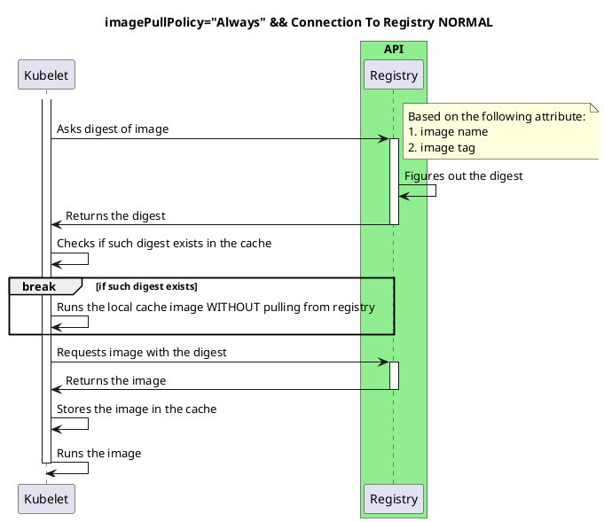
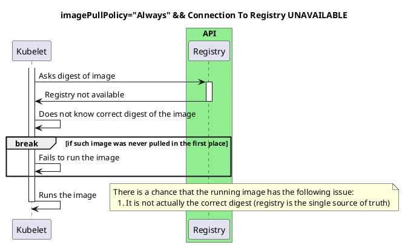

```plantuml

@startuml

title imagePullPolicy="Always" && Connection To Registry NORMAL

participant "Kubelet" as kubelet
box "API" #Lightgreen
  participant "Registry" as registry
box
activate kubelet
  kubelet -> registry: Asks digest of image
  note right
    Based on the following attribute:
    1. image name
    2. image tag
  end note
  activate registry
    registry -> registry: Figures out the digest
    kubelet <- registry: Returns the digest
  deactivate registry
  kubelet -> kubelet: Checks if such digest exists in the cache
  break if such digest exists
    kubelet -> kubelet: Runs the local cache image WITHOUT pulling from registry
  end break
  kubelet -> registry: Requests image with the digest
  activate registry
    kubelet <- registry: Returns the image
  deactivate registry
  kubelet -> kubelet: Stores the image in the cache
  kubelet -> kubelet: Runs the image
deactivate kubelet

```

```plantuml

@startuml

title imagePullPolicy="Always" && Connection To Registry UNAVAILABLE

participant "Kubelet" as kubelet
box "API" #Lightgreen
  participant "Registry" as registry
box
activate kubelet
  kubelet -> registry: Asks digest of image
  activate registry
    kubelet <- registry: Registry not available
  deactivate registry
  kubelet -> kubelet: Does not know correct digest of the image
  break if such image was never pulled in the first place
    kubelet -> kubelet: Fails to run the image
  end break
  kubelet -> kubelet: Runs the image
  note right
    There is a chance that the running image has the following issue:
      1. It is not actually the correct digest (registry is the single source of truth)
  end note
deactivate kubelet

```
