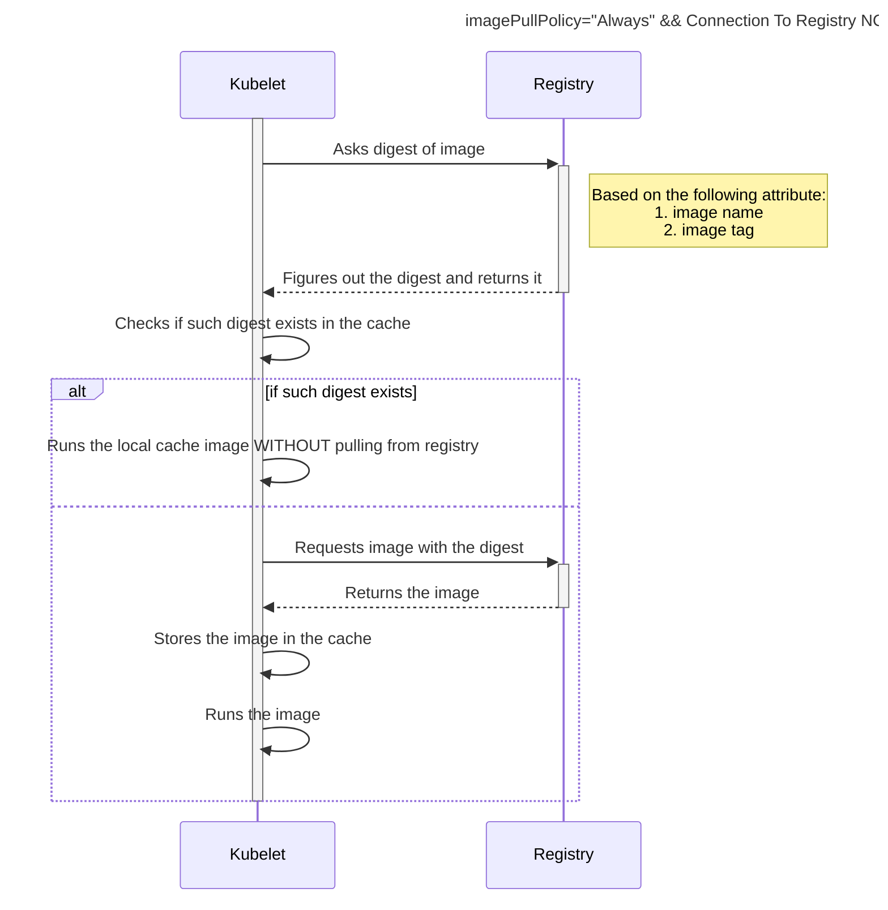
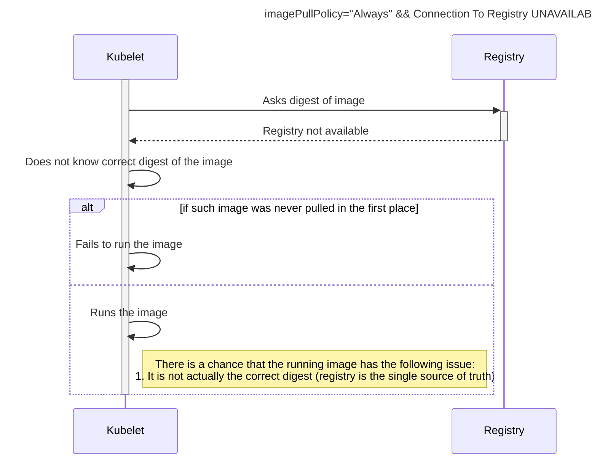

```mermaid

sequenceDiagram
title: imagePullPolicy="Always" && Connection To Registry NORMAL

participant kubelet as Kubelet
participant registry as Registry

activate kubelet
kubelet->>+registry: Asks digest of image
note right of registry: Based on the following attribute:<br>1. image name<br>2. image tag
registry-->>-kubelet: Figures out the digest and returns it
kubelet->>kubelet: Checks if such digest exists in the cache
alt if such digest exists
    kubelet->>kubelet: Runs the local cache image WITHOUT pulling from registry
else
    kubelet->>+registry: Requests image with the digest
    registry-->>-kubelet: Returns the image
    kubelet->>kubelet: Stores the image in the cache
    kubelet->>kubelet: Runs the image
end
deactivate kubelet
```

```mermaid

sequenceDiagram
title: imagePullPolicy="Always" && Connection To Registry UNAVAILABLE

participant kubelet as Kubelet
participant registry as Registry

activate kubelet
kubelet->>+registry: Asks digest of image
registry-->>-kubelet: Registry not available
kubelet->>kubelet: Does not know correct digest of the image
alt if such image was never pulled in the first place
    kubelet->>kubelet: Fails to run the image
else
    kubelet->>kubelet: Runs the image
    note right of kubelet: There is a chance that the running image has the following issue:<br>1. It is not actually the correct digest (registry is the single source of truth)
end
deactivate kubelet


```
